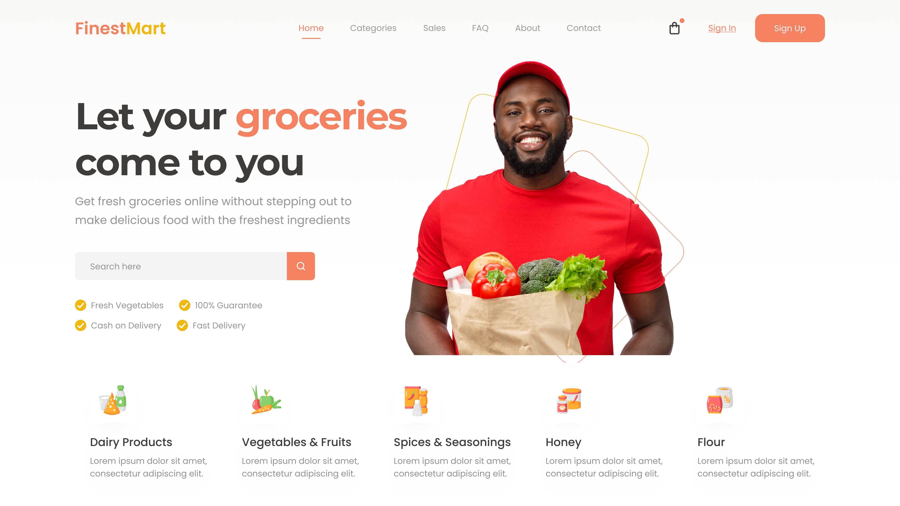

# HTML-SASS Header Grocery Store

## Descripción del proyecto :memo:

En este proyecto encontrarás el encabezado de <b><i>"FinestMart"</i></b>, una plataforma de comercio electrónico ficticia que te permite comprar tus productos de alimentación frescos y de alta calidad sin salir de casa. Con solo unos clics, podrás tener una amplia variedad de frutas, verduras, lácteos, especias y mucho más, directamente en tu puerta.

### ¿Por qué elegir FinestMart?

- <b>Frescura garantizada:</b> nuestros productos son seleccionados cuidadosamente para garantizar su máxima frescura y calidad.
- <b>Entrega rápida:</b> recibe tus compras en la comodidad de tu hogar en tiempo récord.
- <b>Amplio catálogo:</b> explora nuestra extensa variedad de productos para satisfacer todas tus necesidades.
- <b>Pago seguro:</b> realiza tus compras con total confianza gracias a nuestros métodos de pago seguros.

### Aspectos claves del encabezado

- <b>Claridad y concisión:</b> el texto es fácil de entender y va directo al grano.
- <b>Enfoque en los beneficios:</b> destaca los principales beneficios que ofrece "FinestMart" a los usuarios.
- <b>Llamada a la acción:</b> invita a los usuarios a explorar la plataforma y a realizar sus compras.
- <b>Diseño atractivo:</b> utiliza un formato claro y atractivo para facilitar la lectura.
- <b>Palabras clave:</b> incluye palabras clave relevantes para el SEO, como "supermercado en línea", "productos frescos", "entrega a domicilio", etc.

## Vista previa del diseño :clipboard:

En la siguiente imagen se aprecia un detalle del resultado obtenido:

> [!WARNING]
> Este encabezado está diseñado para ofrecer una experiencia visual óptima en pantallas con una resolución de 1200px. De este modo se garantiza que los elementos visuales y la disposición del contenido se presenten de manera atractiva y efectiva en pantallas de este tamaño. 🖥️

## Uso :point_left:

Puedes reutilizar el código para tu propio proyecto web. Simplemente descárgate el repositorio y añádele los cambios necesarios para integrarlo en tu sitio.

## Contribuciones :information_desk_person:

¡Se aceptan contribuciones, claro que sí! Si encuentras algún problema o tienes alguna sugerencia de mejora, no dudes en ponerte en contacto conmigo y aportar tus ideas. Te lo agradeceré infinitamente :handshake:

